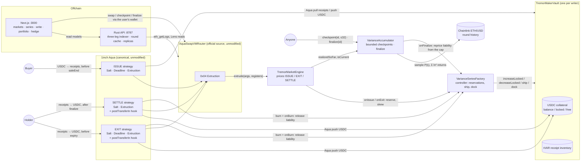

# Tremor architecture



Note what has no arrow into the vault: the writer. Deposits go in and `withdrawFree` comes out, but every
other movement is the controller's, and the controller only ever reserves on a sale and releases on a burn.

## Lifecycle

```
WRITE     writer:  createVault (once) → approve USDC → deposit → createSeries
                   one transaction mints maxUnits into the vault and ships all three strategies
BUY       buyer:   router.swap(ISSUE order, USDC)
                   receipts out, premium into the vault, skew up, collateral reserved at the cap
EXIT      holder:  router.swap(EXIT order, receipts)      before expiry
                   USDC out at the bid, receipts burned, skew down, reservation released
UPDATE    anyone:  accumulator.checkpoint(id, 32)         until stored == available
EXPIRE    saleEnd → ISSUE dead by Deadline;  expiry → EXIT dead by Deadline
FINALIZE  anyone:  accumulator.finalize(id)
                   fixes finalVariance and payoutPerUnit; releases the cap surplus to the writer
REDEEM    holder:  router.swap(SETTLE order, receipts)    no deadline, ever
                   USDC out at payoutPerUnit, receipts burned, reservation released
CLOSE     writer:  factory.closeSeries(id)                only with nothing outstanding
```

## The one-reserve invariant

EXIT and SETTLE are shipped with separate virtual Aqua balances but draw on the vault's single real
balance. The property that makes that safe:

```
released  = lockedLiability(before) − liability(outstanding − unitsFilled)
amountOut ≤ released
```

Both legs burn the receipt they are paid for, so a unit can leave through exactly one of them, and the
money any payout draws is money that stopped being owed in the same transaction. `onBurn` on the
controller is the single place a liability decreases.

## Trust surface

- **Settlement inputs**: Chainlink round history (immutable once written) and the series parameters baked
  into the program bytes.
- **Writer default on a sold unit**: not possible. The collateral is reserved in the vault at the cap and
  the writer cannot withdraw it, cannot revoke the vault's Aqua allowance, cannot move unsold inventory,
  and cannot dock a burn leg while claims exist. Each is tested in `contracts/test/Adversarial.t.sol` and
  demonstrated on a Base fork by `contracts/script/demo.sh` stage C.
- **Liveness**: checkpointing and finalization are permissionless and bounded, but unpaid. Nothing
  settles until somebody calls them; everyone who wants a quote, a redemption or the cap surplus does.
- **The cap**: above it the receipt stops tracking variance. That is the price of a bounded promise a
  vault can fully back.
- No admin keys, no upgradability, no keeper, no pause, no oracle override. Everything a judge needs to
  verify is in the three program byte strings, the contracts' immutables and the feed's own history.
